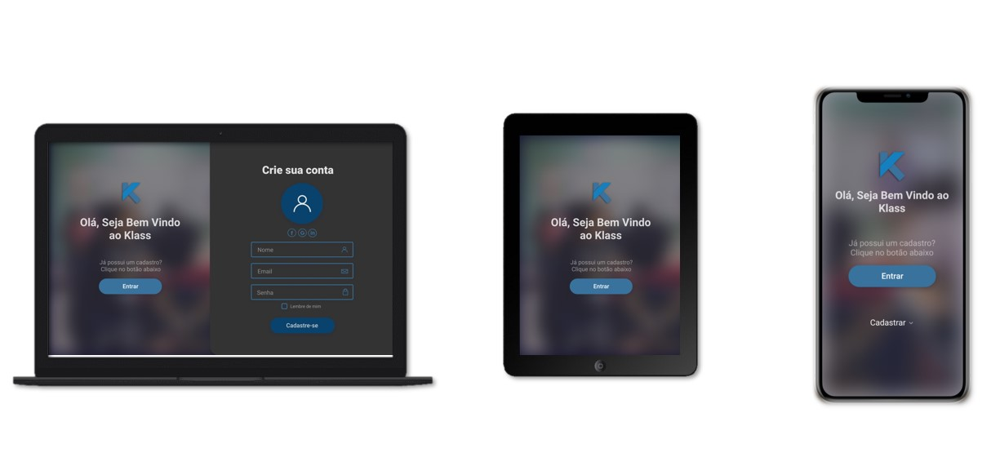

# Klass
Projeto de TCC

<br>

<p align="center">
  
</p>

## 💻 Projeto

O Klass é uma aplicação capaz de facilitar o trabalho de cordenadores, alunos e professores, automatizando a criação e divulgação de horários escolares e grades horárias.

## :busts_in_silhouette: Desenvolvedores

- [Elmer Campos](https://github.com/ElmerCampos)
- [Raphael Gabia](https://github.com/raphael-gabia)
- [Matteo Martins](https://github.com/matteomartins)
- [Vinicius Pereira](https://github.com/ViniciusFloriano)
- [Vinicius Stephanto](https://github.com/stephanto-dev)
- [Vitor Silva](https://github.com/VitorCavalcante9)

## :page_with_curl: Documentação

- Desenvolvendo a ideia
    - [Canvas do Projeto](https://docs.google.com/presentation/d/1Z1a0AT6j1cqnuT0zSRHb5xTNw5duZ2EBxJIyC4qcfig/edit?usp=sharing)
    - [Canvas Persona](https://docs.google.com/presentation/d/1TYSgnnCtL9Xs7BR-M-I1XIexxjCqAKzifD_OBuCXb3I/edit?usp=sharing)
    - [Regras de Negócio](https://docs.google.com/document/d/16mWHoG_VQl5GhHsM9YRXrkWVrkOpqreCrxhkrhHrAcI/edit?usp=sharing)
    - [Funcionalidades](https://docs.google.com/document/d/13V-64ofHABqmF7rmbw4k1oP7EGWMxI5pSmeWIS7v6IA/edit?usp=sharing)
    - [Especificações do projeto](https://docs.google.com/document/d/1KaDQ9hHZdX032D18MAkfoZkHckJlgwyMaqdm-Cl1vD0/edit?usp=sharing)
    - [Levantamento de Requisitos](https://docs.google.com/document/d/1MDRmkzO3xDSZC2Ud06CV34FtFXgcKdSZ_0dmmxfhYT0/edit?usp=sharing)

- Backend
    - [Diagrama de Caso de Uso](https://app.lucidchart.com/documents/edit/1c59bb75-d60a-4fc3-86bf-fd1142f0404e/0_0?shared=true)
    - [Diagrama de Classes](https://app.lucidchart.com/invitations/accept/360dee11-61a2-417f-9a71-3d582a29ac24)
    - [Diagrama de Atividades](https://app.lucidchart.com/invitations/accept/8cf59ed4-3ccc-409e-8f45-b3f0ba9f7257)
    - [Diagrama de Sequência](https://app.lucidchart.com/invitations/accept/7eade794-8c7d-4556-84e9-716f54353f90)
    - [Rotas API](wiki/api_routes/menu.md)
    - [Fluxograma de relatório](https://whimsical.com/MMb39pfkDEyY5GAjgJ6Vpq)
    - [Estrutura de Arquivos](wiki/file_structure.MD)

- Banco de Dados
    - [DER](wiki/der.jpeg?raw=true)
    - [Dicionário de Dados](wiki/DicionarioDeDados.docx?raw=true)

- Frontend
    - [Wireframe](https://miro.com/welcomeonboard/bN6NRyrdnNDJkCfWyxlhtATPSC5hcBnh0PE2uhhf2AGQqNu1CXEvDA9JguDIMhTT)
    - [Estrutura de Arquivos](wiki/file_structure.MD)

## :clock2: Cronograma

O Cronograma do Projeto Klass está dividido em 4 partes, todas elas no ano de 2020. Cada parte dura em média 60 dias e possui diferentes processos re realização de atividades. Clique [nesse link](wiki/CronogramaKlass.xlsx?raw=true) para baixar o [cronograma](wiki/CronogramaKlass.xlsx?raw=true).

## :notebook_with_decorative_cover: Diário de bordo

O Diário de Bordo é uma forma de relatar o que cada participante realizou em cada parte do projeto, deixando claro as conquistas individuais e coletivas. Clique [nesse link](wiki/DiarioDeBordoKlass.docx?raw=true) para baixar o [diário de bordo](wiki/DiarioDeBordoKlass.docx?raw=true).

## :scroll: Monografia

Após a finalização do projeto de pesquisa e programação da aplicação foi realizada uma monografia que além de relatar os passos para o desenvolvimento explica a viabilidade e outros pontos. Clique [nesse link](wiki/MonografiaKlass.docx?raw=true) para baixar a [monografia](wiki/MonografiaKlass.docx?raw=true)

## 🚀 Tecnologias

Esse projeto foi desenvolvido com as seguintes tecnologias:

- [Node.js](https://nodejs.org/en/)
- [Adonis](https://adonisjs.com/)
- [React](https://reactjs.org)
- [MySQL](https://www.mysql.com/)

## 🔖 Layout

Você pode visualizar o layout do projeto através [desse link](https://www.figma.com/file/mvZjbj9Y5rMXsn3zNf6vBA/TCC?node-id=0%3A1). Lembrando que você  precisa ter uma conta no [Figma](http://figma.com/) para acessá-lo.

## :link: Clonar o repositório

Clone o repositório do projeto usando ```git clone https://github.com/stephanto-dev/Klass```. Você precisa do [GIT](https://git-scm.com/) instalado em sua maquina.

## :hammer: Instalação

Para a instalação do projeto é necessário ter o ambiente Node.js instalado no computador. As instruções de instalação para o rutime estão no site oficial do [node.js](http://nodejs.org).

### Backend
Após a clonagem, instale o ambiente do adonis executando o comando ```npm i -g @adonisjs/cli```.


Entre na pasta server do projeto, na raiz (aonde se encontra o arquivo package.json ) e execute o comando ```npm install``` em seu terminal. Aguarde a finalização e certifique-se de que, no final, há uma pasta chamada node_modules nesta mesma raiz.

### Banco de dados

#### Utilizar o MySQL(Padrão)
Após instalar o mysql na sua maquina, crie um banco chamado ```klass``` com o comando ```CREATE DATABASE klass```.

Abra a pasta serve e execute o comando ```adonis migration:run``` para executar as migrations e criar tabelas, views e procedures.

Se quiser criar dados fakes na mesma pasta execute o comando ```adonis seed```.

### Frontend
Depois faça o mesmo na pasta web, execute o comando ```npm install``` em seu terminal. Aguarde a finalização e certifique-se de que, no final, há uma pasta chamada node_modules nesta mesma raiz.


### Inicialização
Para a execução da aplicação backend entre na pasta server e execute o comando ```adonis serve```.


Para a execução da aplicação frontend entre na pasta web e execute o comando ```npm start```.

## :memo: Licença

Esse projeto está sob a licença Apache 2.0. Veja o arquivo [LICENSE](wiki/licence/LICENCE.md) para mais detalhes.
